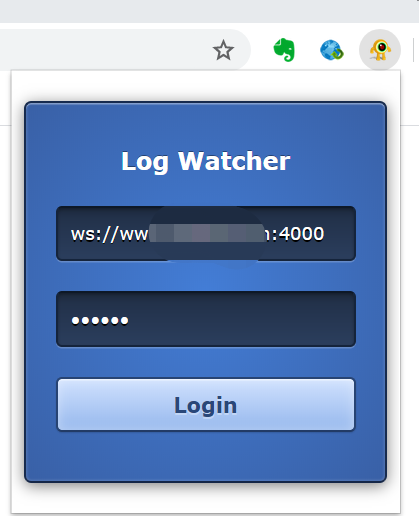

## 在线日志预览插件:

### 1. 功能描述:

本扩展是接受websocket传递日志信息的websocket客户端,并将json字符串进行格式化,具有收缩和展开功能,清屏的三个小功能.

### 2. 安装:

下载到本地:

```shell
git clone git@github.com:liuxing1234/LogWatcher.git
```

在chrome 浏览器中输入,

```url
chrome://extensions/
```

回车--->并勾选开发者模式--->加载已解压的扩展程序--->找到下载好的目录--->选择文件夹

### 3. 使用:

点击扩展输入对应websocket服务器地址,输入身份验证秘钥:




### 4. 后端服务:

下载:

```shell
git clone git@github.com:liuxing1234/LogSea.git
```

